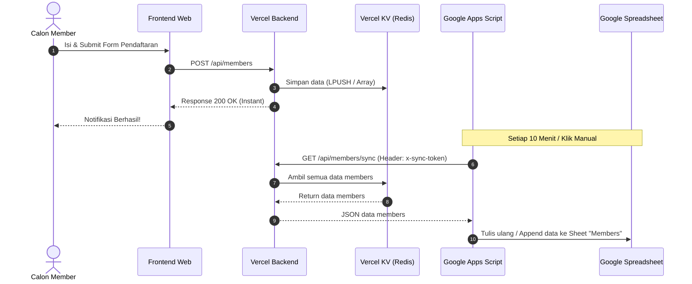

# PRD: Arsitektur Database KV & Sinkronisasi Google Sheets via Apps Script

## 1. Introduction/Overview
Saat ini aplikasi English Club membutuhkan sistem penyimpanan data yang handal, berkecepatan tinggi, dan 100% kompatibel dengan lingkungan *serverless* Vercel. 

Pada arsitektur sebelumnya, backend mencoba melakukan *append* langsung ke Google Sheets API via *Service Account*, yang rentan mengalami *timeout*, kendala parsing `GOOGLE_PRIVATE_KEY`, dan *rate limit* (429) saat pendaftaran ramai.

Dalam arsitektur revisi ini:
1. **Penyimpanan Utama (Primary Store):** Seluruh data interaktif aplikasi—termasuk **Form Pendaftaran Member**, **Leaderboard**, dan **Stories**—disimpan langsung ke **Vercel KV** (Redis-based). Hal ini menjamin proses submit form instan (<200ms) tanpa risiko koneksi putus ke layanan pihak ketiga.
2. **Sinkronisasi Google Sheets (Apps Script Integration):** Data pendaftar yang tersimpan di KV akan ditarik (*pull*) dan disinkronkan / ditulis ulang ke Google Sheets menggunakan **Google Apps Script (GAS)** yang berjalan mandiri di sisi Google Workspace (menggunakan *Time-driven Trigger* terjadwal atau tombol *Sync* manual di Spreadsheet).

---

## 2. Goals
* **Pendaftaran Cepat & Zero Failure:** Pengunjung yang mendaftar langsung menerima respon sukses seketika karena data hanya perlu disimpan ke Vercel KV.
* **Bebas Ketergantungan Service Account:** Mengeliminasi library berat `googleapis` dan konfigurasi rumit Google Service Account (`GOOGLE_PRIVATE_KEY` / IAM Role) di backend Vercel.
* **Tetap Memiliki Spreadsheet Visual:** Panitia tetap dapat melihat dan mengolah data pendaftaran di Google Sheets secara rapi dan terorganisir.
* **Fleksibilitas Update:** Google Apps Script dapat menulis ulang (*rewrite*) atau menambah data baru (*append incremental*) secara berkala tanpa membebani runtime backend Vercel.

---

## 3. User Stories
* **Sebagai calon member**, saya ingin pendaftaran saya langsung terkirim sukses dalam hitungan detik tanpa *loading* lama atau *error timeout*.
* **Sebagai panitia/admin**, saya ingin data pendaftar otomatis muncul dan tersinkronisasi di Google Sheets untuk kebutuhan rekapitulasi dan follow-up via WhatsApp.
* **Sebagai developer**, saya ingin arsitektur backend sederhana, mudah dirawat di Vercel, dan tidak terkunci oleh pembatasan kuota Google API langsung di request lifecycle pengguna.

---

## 4. Functional Requirements

### 4.1. Penyimpanan Form Pendaftaran di Vercel KV
* Endpoint `POST /api/members`:
  * Menerima payload: `{ nama, no_hp, jurusan }`.
  * Melakukan validasi input (panjang nama, format nomor HP `08xxxxxxxxxx`, daftar jurusan resmi).
  * Menghasilkan record dengan format:
    ```json
    {
      "id": "mem_<timestamp>_<random>",
      "timestamp": "2026-09-09T22:30:00.000Z",
      "nama": "Fathan",
      "no_hp": "081234567890",
      "jurusan": "Ilmu Komputer"
    }
    ```
  * Menyimpan record ke dalam Vercel KV (menggunakan key `members` berupa array JSON atau Redis list).
  * Merespon balik ke frontend dengan status `200 OK`.

### 4.2. Endpoint Ekspor & Sinkronisasi untuk Apps Script
* Endpoint `GET /api/members/sync` atau `GET /api/members/export`:
  * Dilindungi dengan *Security Token* melalui header `x-sync-token` atau `Authorization: Bearer <SYNC_TOKEN>`.
  * Mengembalikan daftar seluruh pendaftar dari KV dalam format JSON (atau CSV siap pakai).
  * Opsi query: `?since=<timestamp>` jika ingin mendukung sinkronisasi incremental, atau default mengembalikan seluruh baris untuk *full rewrite*.

### 4.3. Script Sinkronisasi Google Apps Script (GAS)
* Ditempatkan langsung di file Google Sheets (`Extensions` -> `Apps Script`).
* **Fitur Utama:**
  1. **Full Rewrite / Sync Terjadwal:**
     * Memanggil endpoint backend menggunakan `UrlFetchApp.fetch()`.
     * Mengosongkan data lama (mempertahankan header) atau melakukan perbandingan baris.
     * Menuliskan data terbaru (`Timestamp`, `Nama`, `No HP`, `Jurusan`).
  2. **Triggers:**
     * *Time-driven Trigger:* Berjalan otomatis setiap 5, 10, atau 15 menit.
     * *Custom Menu:* Menambahkan menu di Google Sheets (`English Club Menu` -> `Sync Pendaftar Sekarang`) untuk kemudahan panitia melakukan sync on-demand.

### 4.4. Leaderboard & Stories (Tetap di Vercel KV)
* Leaderboard (`/api/leaderboard`) dan Stories (`/api/stories`) tetap berjalan sepenuhnya di atas Vercel KV seperti spesifikasi awal.

---

## 5. Non-Goals (Out of Scope)
* **Two-way Sync (Sheets ke KV):** Data bersifat satu arah (*One-Way Sync* dari KV ke Google Sheets). Pengeditan langsung di Google Sheets tidak akan di-sync kembali ke database KV.
* **Service Account Integration:** Tidak menggunakan Google Cloud Console Service Account key JSON di backend Vercel.

---

## 6. Technical Specifications & Architecture

### Diagram Alur Data


### Environment Variables yang Diperlukan di Vercel
| Variable | Deskripsi | Wajib |
|---|---|---|
| `KV_REST_API_URL` | URL REST API Vercel KV / Upstash Redis | Ya |
| `KV_REST_API_TOKEN` | Token REST API Vercel KV | Ya |
| `SYNC_TOKEN` | Token rahasia yang dicocokkan dengan Apps Script | Ya |
| `ADMIN_TOKEN` | Token untuk akses admin dashboard web | Ya |

*(Variabel Google Service Account seperti `GOOGLE_CLIENT_EMAIL` dan `GOOGLE_PRIVATE_KEY` sudah tidak diperlukan lagi).*

---

## 7. Integrasi 1 Spreadsheet Bersama Google Form (Multi-Tab Architecture)

Jika panitia **sudah memiliki Google Spreadsheet yang terhubung ke Google Form**, sistem Apps Script ini **sangat bisa dan direkomendasikan** digabungkan ke dalam 1 file spreadsheet yang sama:

### Struktur Tab yang Direkomendasikan:
1. **Tab `Form Responses 1` (atau `Tanggapan Formulir 1`):**
   * Dibiarkan default, tetap menerima jawaban langsung dari Google Form tanpa diganggu script.
2. **Tab `Members Web` (dikelola oleh Apps Script):**
   * Apps Script akan otomatis membuat/menulis tab khusus ini untuk menampung pendaftar dari website (Vercel KV).
   * Menjaga integritas data agar sinkronisasi dari web tidak menabrak baris yang di-insert otomatis oleh Google Form.
3. **Tab `Semua Pendaftar (Rekap Otomatis)` (Opsional - Rumus Formula):**
   * Panitia dapat membuat tab rekap gabungan menggunakan formula Google Sheets untuk menggabungkan data dari Google Form dan Web sekaligus:
     ```excel
     ={ 'Form Responses 1'!A2:D; 'Members Web'!A2:D }
     ```

---

## 8. Referensi Template Google Apps Script

Script berikut dimasukkan ke menu **Extensions (Ekstensi) > Apps Script** pada file Google Spreadsheet yang sudah ada:

```javascript
const API_URL = "https://your-domain.vercel.app/api/members/sync";
const SYNC_TOKEN = "your-secret-sync-token";
const SHEET_NAME = "Members Web"; // Tab khusus di spreadsheet yang sama

function onOpen() {
  const ui = SpreadsheetApp.getUi();
  ui.createMenu("English Club")
    .addItem("Sync Pendaftar Web Sekarang", "syncMembersFromKV")
    .addToUi();
}

function syncMembersFromKV() {
  const options = {
    method: "get",
    headers: {
      "x-sync-token": SYNC_TOKEN
    },
    muteHttpExceptions: true
  };

  const response = UrlFetchApp.fetch(API_URL, options);
  if (response.getResponseCode() !== 200) {
    Logger.log("Gagal sync: " + response.getContentText());
    return;
  }

  const data = JSON.parse(response.getContentText());
  const members = data.members || [];

  const ss = SpreadsheetApp.getActiveSpreadsheet();
  let sheet = ss.getSheetByName(SHEET_NAME);
  
  // Jika tab belum ada, otomatis dibuatkan tanpa mengganggu tab Google Form
  if (!sheet) {
    sheet = ss.insertSheet(SHEET_NAME);
  }

  // Header kolom di tab Members Web
  if (sheet.getLastRow() === 0) {
    sheet.appendRow(["Timestamp", "Nama Lengkap", "No HP", "Jurusan", "Sumber"]);
    sheet.getRange("A1:E1").setFontWeight("bold").setBackground("#e8f0fe");
  }

  if (members.length === 0) return;

  // Format baris data pendaftar dari web
  const rows = members.map(m => [
    m.timestamp,
    m.nama,
    "'" + m.no_hp, // Tanda kutip agar format 08xx tidak menjadi angka bulat
    m.jurusan,
    "Website"
  ]);

  // Bersihkan data lama (kecuali header baris 1) lalu tulis data terkini
  const existingRows = sheet.getLastRow();
  if (existingRows > 1) {
    sheet.getRange(2, 1, existingRows - 1, 5).clearContent();
  }

  sheet.getRange(2, 1, rows.length, 5).setValues(rows);
  Logger.log("Berhasil sinkronisasi " + rows.length + " pendaftar dari website.");
}
```

### Cara Pasang Otomatis (Time-driven Trigger):
1. Di editor Apps Script, klik ikon jam (**Triggers / Pemicu**) di menu samping kiri.
2. Klik **Add Trigger** (Tambah Pemicu) di pojok kanan bawah.
3. Pilih fungsi: `syncMembersFromKV`.
4. Pilih sumber acara: **Time-driven** (Berdasarkan waktu).
5. Pilih jenis pemicu berbasis waktu: **Minutes timer** (Pengatur waktu menit) -> **Every 10 minutes** (Setiap 10 menit).
6. Simpan. Pendaftar dari web akan otomatis masuk ke tab `Members Web` setiap 10 menit.

---

## 9. Success Metrics
* **Waktu Respon Submit Form:** Rata-rata pendaftaran selesai dalam waktu < 250ms.
* **Kehandalan:** Tingkat kegagalan pendaftaran akibat masalah eksternal Google API berkurang menjadi 0%.
* **Zero Conflict dengan Google Form:** Pendaftar dari Google Form dan Pendaftar dari Website terkumpul rapi dalam 1 Spreadsheet tanpa ada data yang tertimpa atau error.